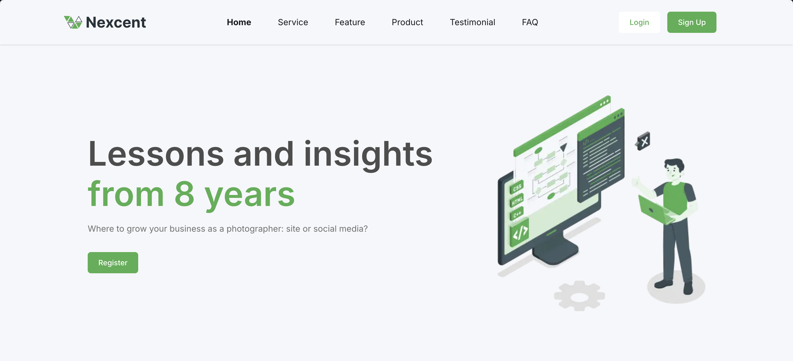

# Nexcent Landing Page

<div align="center">
  
</div>

## About the Project
Nexcent is a modern, responsive landing page built for community organizations, businesses, and platform memberships. It features a clean and premium design tailored for highlighting client portfolios, community management features, marketing insights, and product demos.

The application is built using a modern frontend stack:
- **Framework**: [Next.js](https://nextjs.org/) (App Directory)
- **Styling**: Tailwind CSS
- **Icons/Images**: Custom SVG assets

## Getting Started

Follow these instructions to set up the project locally and run the development server.

### Prerequisites
Make sure you have Node.js and `pnpm` installed.

### Installation

1. Clone the repository and navigate to the project directory:
   ```bash
   cd nexcent
   ```

2. Install the dependencies:
   ```bash
   pnpm install
   ```

### Running the Development Server

Start the development server with:

```bash
pnpm dev
```

Open [http://localhost:3000](http://localhost:3000) with your browser to see the result. The page will auto-update as you edit the source files!

---

*This project was bootstrapped with [`create-next-app`](https://github.com/vercel/next.js/tree/canary/packages/create-next-app).*
